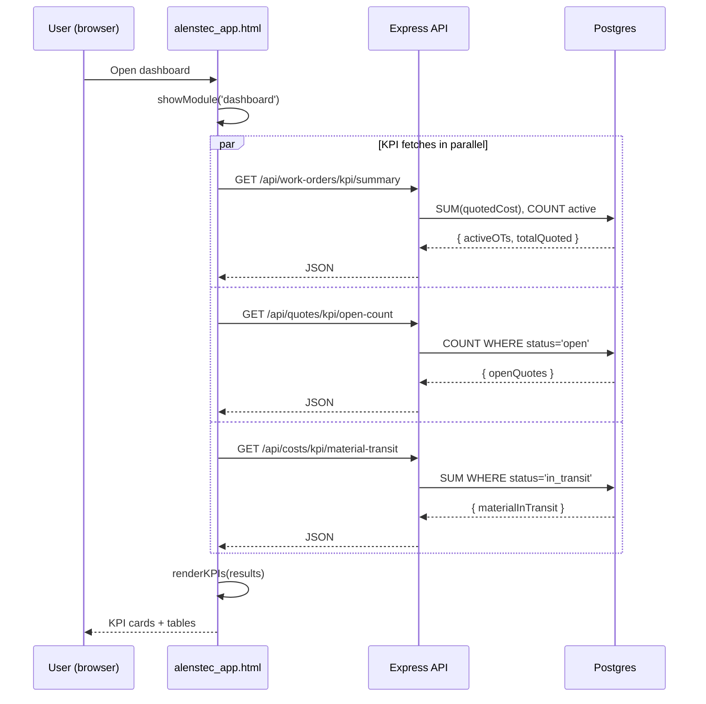
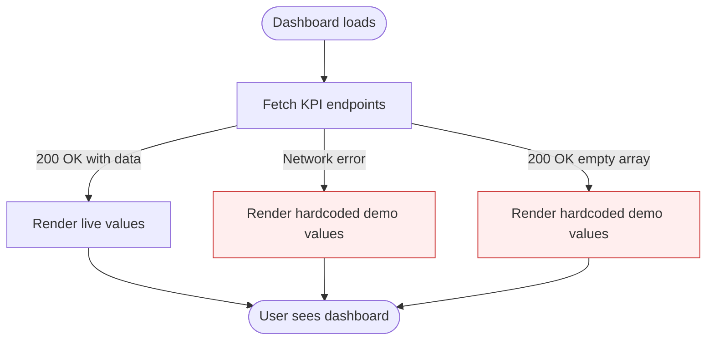

# 01 — Dashboard & Analytics

Spec: [dashboard.md](../docs/modules/dashboard.md)

## 1. Requirement recap

- Executive dashboard: active OT count, quoted cost, material in transit, open quotes.
- Recent work orders table with progress.
- Cost-by-OT bar chart.
- Supplier timeline, open POs, employees in field.
- Drill-down and real-time refresh (spec).

## 2. Intended design

### 2.1 Data flow per KPI card

### 2.2 Fallback behavior (current)

The red-highlighted paths are the silent-fail problem: users cannot distinguish live data from demo data. **This must be fixed before any KPI regression test is meaningful.**

### 2.3 Target KPI aggregation rules

| KPI                       | Source table   | Aggregation                                   | Currency normalization |
|---------------------------|----------------|------------------------------------------------|------------------------|
| Active OTs                | WorkOrder      | COUNT WHERE status IN ('en_proceso','aprobada') | n/a                    |
| Total quoted cost         | WorkOrder      | SUM(quotedCost) in MXN equivalent              | Convert USD via FX rate |
| Material in transit       | MaterialCost   | SUM(totalCost) WHERE status='en_transito'     | Convert USD via FX rate |
| Open quotes               | Quote          | COUNT WHERE status IN ('draft','sent')        | n/a                    |

## 3. Current implementation

| Piece                              | Location                                           | State |
|------------------------------------|----------------------------------------------------|-------|
| KPI cards markup                   | [alenstec_app.html](../alenstec_app.html)          | Present, values hardcoded |
| `loadWorkOrders()`                 | alenstec_app.html:~1081                             | Fetches `/api/work-orders`, silent fallback |
| `loadQuotes()`                     | alenstec_app.html:~1095                             | Same pattern |
| `loadSuppliers()`                  | alenstec_app.html:~1105                             | Same pattern |
| `/api/work-orders/kpi/summary`     | [backend/src/routes/workOrders.js](../backend/src/routes/workOrders.js) | Wired |
| `/api/quotes/kpi/open-count`       | [backend/src/routes/quotes.js](../backend/src/routes/quotes.js)         | Wired |
| `/api/costs/kpi/material-transit`  | [backend/src/routes/costs.js](../backend/src/routes/costs.js)           | Wired |
| Currency normalization             | —                                                  | Missing (FX rate is hardcoded constant) |
| Real-time refresh                  | —                                                  | Not implemented (no WebSocket, no polling) |

## 4. Regression-test candidates

### 4.1 Backend (integration, against test DB)

- `/api/work-orders/kpi/summary` returns `{ activeOTs, totalQuoted }` with correct counts for seeded fixtures.
- `/api/quotes/kpi/open-count` excludes `won` and `lost` statuses.
- `/api/costs/kpi/material-transit` sums only `status='en_transito'`.
- All KPI endpoints return 200 with empty-state defaults when tables are empty (no 500).

### 4.2 Frontend (DOM + fetch mock)

- With mocked `fetch` returning real payloads, KPI cards render the values from the response (not the hardcoded defaults).
- With `fetch` rejected, KPI cards render defaults **and** surface a visible "demo data" indicator (this indicator does not exist yet — **test should fail until added**).
- Module-switch navigation preserves dashboard state on return.

### 4.3 Known not-testable-yet

- Drill-down (not implemented).
- Real-time updates (not implemented).
- Multi-currency accuracy (FX is a constant).
