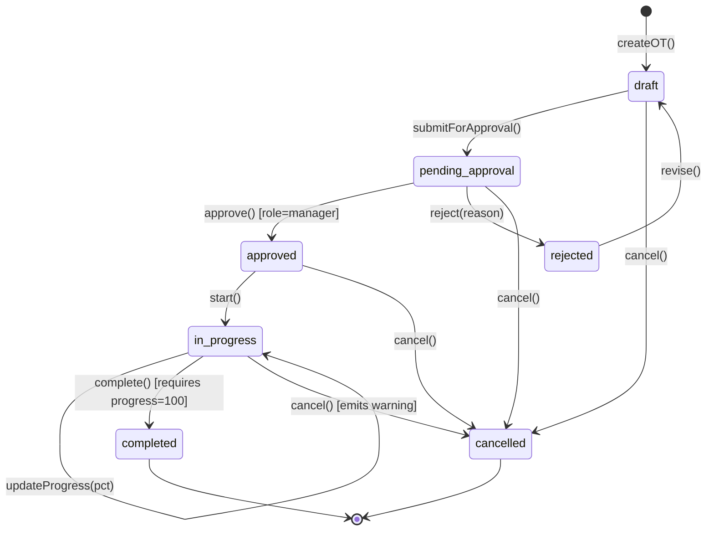
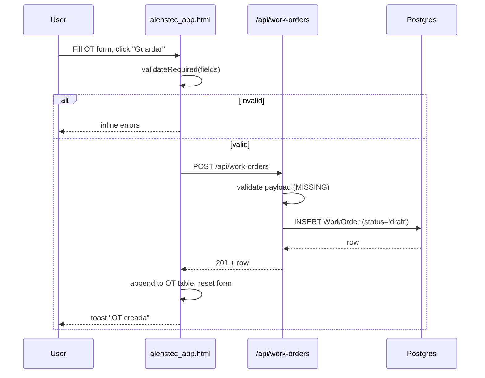
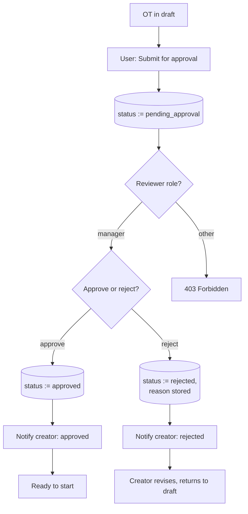

# 02 — Work Order Management

Spec: [work-order-management-features.md](../work-order-management-features.md)

## 1. Requirement recap

- Create/edit/delete OT with fields: OT #, client, description, type (Nuevo / Refurbish / Servicio), quoted vs actual cost, currency, dates, progress.
- Approval workflow with multiple roles and state transitions.
- Progress tracking with percentage completion.
- PDF export of OT packet.
- Status pipeline: `draft → approved → in_progress → completed` (+ cancelled).
- Email notifications on transitions.

## 2. Intended design

### 2.1 OT lifecycle state machine

Invariants the state machine must enforce:

- `completed` requires `progress === 100` and at least one `LaborCost` and one `MaterialCost` attached.
- `approved` requires `quotedCost > 0` and `client !== null`.
- Only `manager` role can invoke `approve` / `reject`.
- `cancelled` is terminal.
- Backwards transitions (e.g., `completed → in_progress`) are not permitted — audit trail required for any correction.

### 2.2 Create-OT sequence

### 2.3 Approval workflow

### 2.4 Data model additions vs current

Current `WorkOrder` model has: `otNumber, client, description, type, progress, status, quotedCost, actualCost, currency, startDate, endDate`.

Missing for workflow:

- `createdBy`, `approvedBy`, `approvedAt`
- `rejectionReason`
- `version` (for optimistic locking on concurrent edits)
- History table `WorkOrderTransition(fromStatus, toStatus, userId, timestamp, note)`

## 3. Current implementation

| Piece                      | Location                                   | State |
|----------------------------|--------------------------------------------|-------|
| `WorkOrder` Sequelize model | [backend/models/WorkOrder.js](../backend/models/WorkOrder.js) | Present, missing audit fields |
| CRUD routes                | [backend/routes/workOrders.js](../backend/routes/workOrders.js) | GET/POST/PUT/DELETE wired |
| State machine              | —                                          | Not implemented; `status` is a free-text column |
| Approval endpoints         | —                                          | Not implemented |
| Role check / RBAC          | —                                          | Not implemented |
| Transition audit log       | —                                          | Not implemented |
| PDF export                 | alenstec_app.html (jsPDF + html2canvas)    | Works on current DOM snapshot |
| OT form submission         | —                                          | Button exists, no handler |
| Notifications              | —                                          | Not implemented |

## 4. Regression-test candidates

### 4.1 Testable now

- `WorkOrder` model: `create`, `findAll`, `findByPk`, `update`, `destroy` against test DB.
- `GET /api/work-orders?status=...&dateFrom=...&dateTo=...` filter semantics.
- `POST /api/work-orders` rejects missing required fields (will fail today — **drives adding validation**).
- PDF export: given a fixed DOM fixture, generated PDF has expected page count and contains the OT number string.

### 4.2 Testable after state machine lands

- Each legal transition in §2.1 succeeds.
- Each illegal transition returns 409 with a clear error code.
- `approve` without `role=manager` returns 403.
- `complete` with `progress < 100` returns 422.
- Every transition appends a `WorkOrderTransition` row.

### 4.3 Testable after form wiring

- UI create flow produces a row visible in the OT table without page refresh.
- UI shows server-side validation errors inline.
- Concurrent edit from two tabs: second save fails with 409 on version mismatch.
