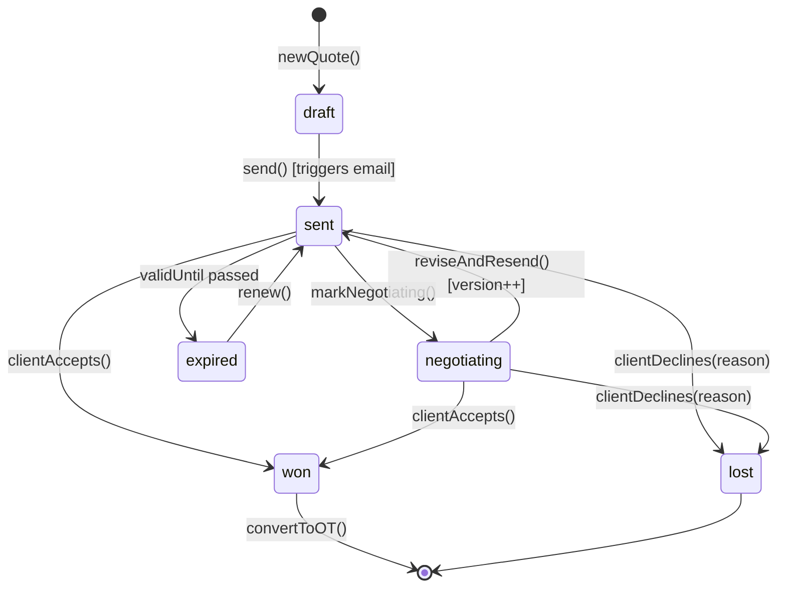
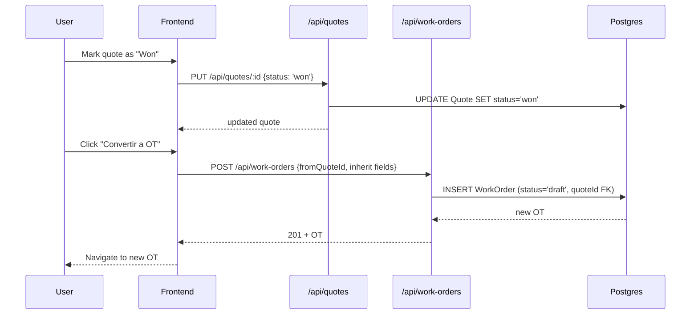
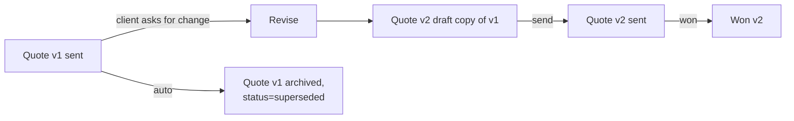

# 03 — Sales & Quoting

Spec: [sales-quoting-features.md](../sales-quoting-features.md)

## 1. Requirement recap

- Quote creation with line items, multi-currency (MXN / USD).
- Quote versioning (v1, v2, ...) when revised.
- Status pipeline: `draft → sent → negotiating → won | lost | expired`.
- PDF generation and email delivery to client.
- Conversion from won quote → WorkOrder.
- Sales dashboard with conversion rate, pipeline value, win/loss.
- CRM-lite: client contacts, interaction log.

## 2. Intended design

### 2.1 Quote state machine

### 2.2 Quote → Work Order conversion

### 2.3 Versioning rule

Each revision creates a **new row** with `parentQuoteId = v1.id` and `version = v1.version + 1`. v1 is frozen for audit.

## 3. Current implementation

| Piece                           | Location                                      | State |
|---------------------------------|-----------------------------------------------|-------|
| `Quote` Sequelize model         | [backend/models/Quote.js](../backend/models/Quote.js) | `quoteNumber, client, description, amount, currency, status, validUntil` — no versioning fields |
| CRUD routes                     | [backend/routes/quotes.js](../backend/routes/quotes.js) | GET/POST/PUT + `/kpi/open-count` wired |
| Quote state machine             | —                                             | Not implemented |
| Versioning                      | —                                             | Not implemented |
| PDF generation for quote        | —                                             | Not implemented (only OT has PDF) |
| Email delivery                  | —                                             | Not implemented |
| Quote → OT conversion           | —                                             | Not implemented |
| Frontend: quote form            | —                                             | Table displays static data; no form |
| Frontend: sales dashboard KPIs  | alenstec_app.html (mod-cotizaciones)          | Hardcoded values |

## 4. Regression-test candidates

### 4.1 Testable now

- `Quote` model CRUD against test DB.
- `GET /api/quotes?status=...` filter correctness.
- `GET /api/quotes/kpi/open-count` counts only `draft` + `sent` (and `negotiating` once implemented).
- `POST /api/quotes` rejects payload missing `client` or `amount`.

### 4.2 Testable after state machine + versioning land

- Each legal transition in §2.1.
- Illegal transitions (e.g., `won → draft`) return 409.
- `reviseAndResend()` creates new row, bumps `version`, marks parent `superseded`.
- `validUntil` < today automatically moves `sent → expired` via a scheduled job.

### 4.3 Testable after conversion lands

- Quote with `status='won'` can be converted to OT; resulting OT inherits `client`, `amount`, `currency`.
- Quote with `status ≠ 'won'` cannot be converted (422).
- Double-conversion of the same quote returns 409.
