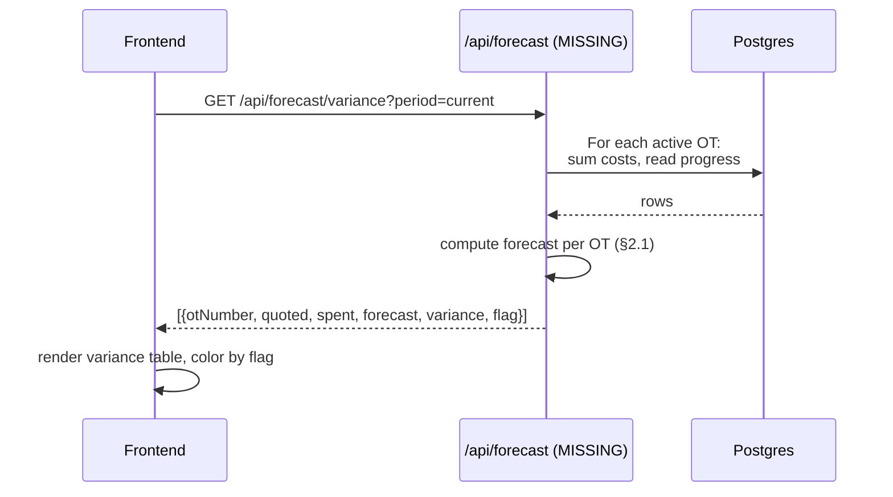
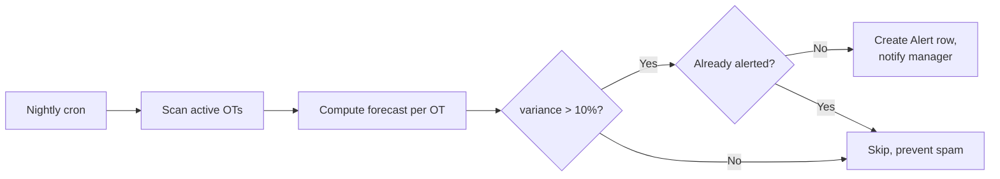

# 04 — Cost Forecasting

Spec: [cost-forecasting.md](../docs/modules/cost-forecasting.md)

## 1. Requirement recap

- Cost projection per OT: forecasted total vs budget.
- Variance analysis: quoted vs actual, % deviation, trending.
- Budget management: set, lock, release.
- Alerts when an OT is projected to exceed budget.
- What-if scenarios (sensitivity analysis).
- Historical cost analysis for similar OTs.

## 2. Intended design

### 2.1 Forecast algorithm (simple baseline)

```mermaid
flowchart TD
  START([Compute forecast for OT]) --> A[Sum actual MaterialCost so far]
  START --> B[Sum actual LaborCost so far]
  A --> C[materialSpent]
  B --> D[laborSpent]
  C --> E[spent := materialSpent + laborSpent]
  D --> E
  E --> F{progress > 0?}
  F -- No --> G[forecastTotal := quotedCost]
  F -- Yes --> H[forecastTotal := spent / progress × 100]
  G --> J[variance := forecastTotal − quotedCost]
  H --> J
  J --> K{variance / quotedCost > threshold?}
  K -- Yes --> L[Flag OT as "over-budget risk"]
  K -- No --> M[OT within budget]
  L --> END([Return forecast + flag])
  M --> END
```

Baseline formula: `forecastTotal = spent ÷ progressPct × 100`. This is naive but auditable. Machine-learning refinement is out of MVP scope.

### 2.2 Variance dashboard data flow



### 2.3 Alert trigger



## 3. Current implementation

| Piece                     | Location                                | State |
|---------------------------|-----------------------------------------|-------|
| `mod-pronostico` UI       | alenstec_app.html                       | Static variance table, hardcoded rows |
| Forecast endpoint         | —                                       | Missing |
| Variance computation      | —                                       | Missing |
| Budget model              | —                                       | Missing (no `Budget` table) |
| Alert model + cron        | —                                       | Missing |
| What-if scenarios         | —                                       | Missing |

## 4. Regression-test candidates

### 4.1 Testable now

- Nothing — this module has no backend code.

### 4.2 Testable once §2.1 lands

- `forecastTotal` with `progress=0` returns `quotedCost` (no divide-by-zero).
- `forecastTotal` with `progress=50, spent=500` returns `1000`.
- `variance` is signed (positive = over budget).
- `flag = true` when `|variance / quoted| > threshold`.
- Endpoint returns empty array (not 500) when no active OTs exist.
- Historical OTs (completed) are excluded from active-forecast scan.

### 4.3 Testable once alerts land

- Duplicate alert suppression: re-running scan on unchanged data emits zero new alerts.
- Alert row created with `{otId, variance, createdAt, notifiedAt}`.
- Clearing an alert (OT back under budget) marks it `resolved`, not deleted.
