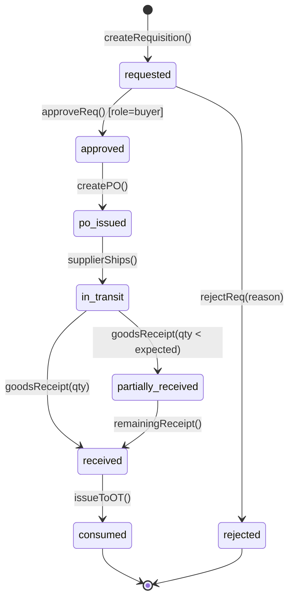
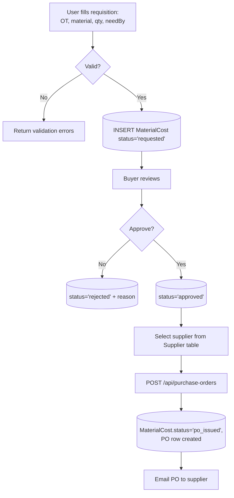
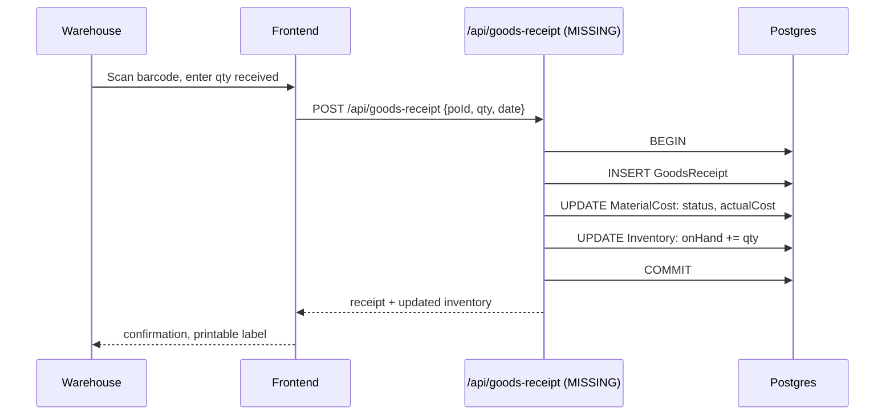

# 05 — Material Management

Spec: [material.md](../docs/modules/material.md)

## 1. Requirement recap

- Material requisition tied to an OT.
- Supplier quote comparison.
- Auto-generated Purchase Order from approved requisition.
- Goods receipt / partial receipt tracking.
- Inventory on-hand by material and location.
- Barcode support.

## 2. Intended design

### 2.1 Material lifecycle (requisition → inventory)

### 2.2 Requisition → PO flow

### 2.3 Goods receipt

### 2.4 Data model gaps

Current `MaterialCost` has: `otNumber, materialDescription, quantity, unitCost, totalCost, currency, supplier, status, deliveryDate`.

Missing tables for full lifecycle:

- `PurchaseOrder(poNumber, supplierId, issuedAt, expectedDelivery, total, status)`
- `GoodsReceipt(poId, receivedAt, qty, receivedBy)`
- `Inventory(materialCode, location, onHand, reserved, lastCountedAt)`
- `MaterialCatalog(code, description, unit, defaultSupplier)`

## 3. Current implementation

| Piece                             | Location                                      | State |
|-----------------------------------|-----------------------------------------------|-------|
| `MaterialCost` model              | [backend/src/models/MaterialCost.js](../backend/src/models/MaterialCost.js) | Partial — one flat row per material entry |
| `POST /api/costs/material`        | [backend/src/routes/costs.js](../backend/src/routes/costs.js) | Wired |
| `GET /api/costs/material`         | same                                          | Wired with filters |
| PO / GoodsReceipt / Inventory     | —                                             | Missing |
| Supplier quote comparison         | —                                             | Missing |
| Barcode                           | —                                             | Missing |
| Requisition UI                    | alenstec_app.html (mod-material)              | Static table only |
| Deliveries UI                     | alenstec_app.html (mod-entregas, 5 sub-tabs)  | Shell only, no data binding |

## 4. Regression-test candidates

### 4.1 Testable now

- `POST /api/costs/material` creates a row; retrievable via `GET`.
- `GET /api/costs/material?otNumber=X` filters correctly.
- `GET /api/costs/kpi/material-transit` sums `status='en_transito'` only.
- Validation: negative `quantity` or `unitCost` rejected (will fail today — **drives adding validation**).

### 4.2 Testable after PO + receipt land

- PO issuance transitions `MaterialCost.status: approved → po_issued`.
- Goods receipt with `qty < expected` transitions to `partially_received`.
- Goods receipt total never exceeds `PO.qty` (422 on overage).
- Inventory `onHand` increments atomically with receipt (integration test with concurrent receipts).

### 4.3 Testable after inventory lands

- `onHand − reserved >= 0` invariant holds after any issuance.
- Cycle count adjustment creates `InventoryAdjustment` audit row.
