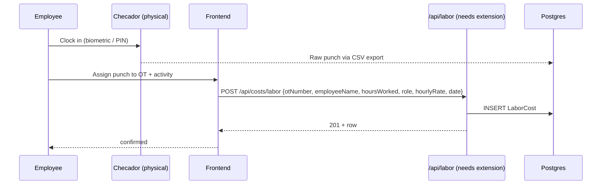
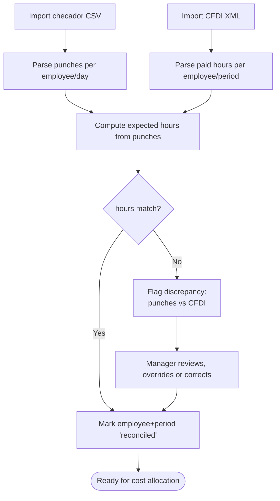
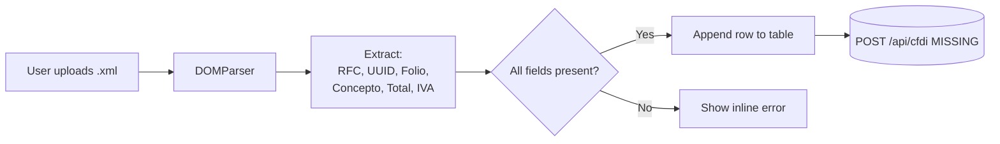

# 06 — Labor Management

Spec: [labor.md](../docs/modules/labor.md)

## 1. Requirement recap

- Employee clock-in/out.
- Project/activity time allocation.
- Overtime calculation and approval.
- Attendance monitoring and conciliación against checador (physical clock).
- CFDI-based payroll import.
- Labor cost per OT / department / employee.
- Forecasting and workforce planning (out of MVP).

## 2. Intended design

### 2.1 Time tracking data flow



### 2.2 Conciliación (reconciliation) flow

The physical clock (`checador`) exports punches in CSV/XLS. Payroll exports CFDI XML. The reconciliation module matches them.



### 2.3 CFDI XML parse pipeline (client-side, exists today)



The red edge is the gap: today CFDI is parsed and rendered but never persisted, so uploads are lost on refresh.

### 2.4 Overtime calculation rule

```mermaid
flowchart TD
  START([For each LaborCost row]) --> A{hoursWorked ≤ 8?}
  A -- Yes --> B[regular := hoursWorked<br/>overtime := 0]
  A -- No --> C[regular := 8<br/>overtime := hoursWorked − 8]
  C --> D{overtime ≤ 3?}
  D -- Yes --> E[otPay := overtime × rate × 2<br/>double-pay]
  D -- No --> F[otPay := 3×rate×2<br/>+ (overtime−3)×rate×3<br/>triple-pay past 3h]
  B --> OUT[totalPay = regular×rate + otPay]
  E --> OUT
  F --> OUT
```

This matches Mexican LFT (Ley Federal del Trabajo) Art. 66–68 as a baseline; edge cases (night shift, holidays) are out of MVP.

## 3. Current implementation

| Piece                        | Location                                           | State |
|------------------------------|----------------------------------------------------|-------|
| `LaborCost` model            | [backend/src/models/LaborCost.js](../backend/src/models/LaborCost.js) | Present, no OT/regular split |
| `POST /api/costs/labor`      | [backend/src/routes/costs.js](../backend/src/routes/costs.js) | Wired |
| `GET /api/costs/labor`       | same                                               | Wired with filters |
| Clock-in/out                 | —                                                  | Not implemented |
| Checador CSV import          | alenstec_app.html:~1444-1522                       | Client-side only; calls `/api/conciliacion/*` which doesn't exist |
| CFDI XML parse               | alenstec_app.html:~1641-1750                       | Works client-side; no persistence |
| Conciliación backend         | —                                                  | Missing — endpoints referenced by FE do not exist |
| Overtime calculation         | —                                                  | Not implemented |
| `asistencia-modulo/`         | standalone skeleton                                | Empty; not wired |

## 4. Regression-test candidates

### 4.1 Testable now

- CFDI XML parser: given fixture XML with known RFC/UUID/Folio/Total, function returns matching object. Deterministic; ideal first unit test target.
- CFDI parser with malformed XML returns structured error (no exception).
- CFDI parser ignores namespace variants (`cfdi:` vs default namespace).
- `LaborCost` model CRUD against test DB.
- `POST /api/costs/labor` validation: rejects negative `hoursWorked` (will fail today).

### 4.2 Testable after overtime calc lands

- Row with `hoursWorked=8` → `overtime=0`.
- Row with `hoursWorked=10` → `overtime=2, otPay = 2 × rate × 2`.
- Row with `hoursWorked=12` → `overtime=4, otPay = 3 × rate × 2 + 1 × rate × 3`.
- Row with `hoursWorked=0` → `totalPay=0`.

### 4.3 Testable after conciliación lands

- Checador import with N punches creates N normalized rows.
- Reconciliation exact match → `status='reconciled'`.
- Reconciliation mismatch → `status='discrepancy'` with delta stored.
- Manager override creates audit entry.

### 4.4 Known broken path (test should fail → drives fix)

- Frontend POST to `/api/conciliacion/import` returns 404 — test today, green once backend is added.
