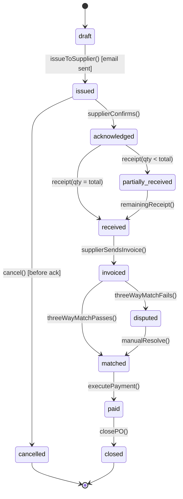
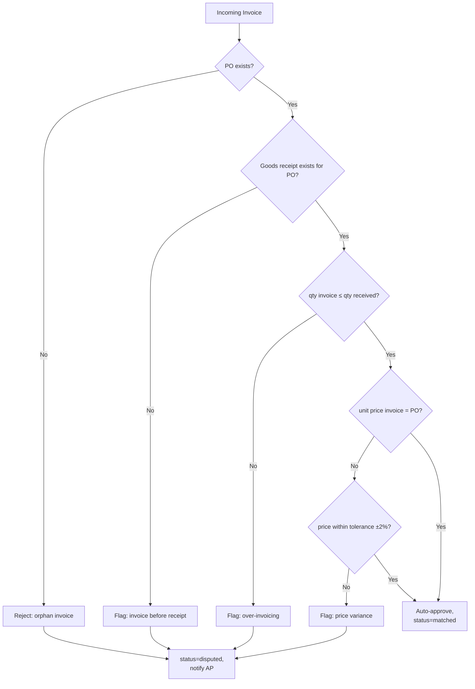

# 07 — Supplier & Procurement

Spec: [supplier-procurement-features.md](../supplier-procurement-features.md)

## 1. Requirement recap

- Supplier master with categories, contacts, status.
- Purchase Order lifecycle: draft → issued → acknowledged → received → closed.
- Invoice processing with CFDI validation.
- 3-way match: PO ↔ Goods Receipt ↔ Invoice.
- Supplier performance scoring (on-time %, quality, price competitiveness).
- Payment terms and scheduling.

## 2. Intended design

### 2.1 PO state machine



### 2.2 Three-way match



### 2.3 Supplier scoring (nightly job)

```mermaid
flowchart LR
  CRON[Nightly] --> FOREACH[For each supplier]
  FOREACH --> A[on-time %<br/>= received_on_time / received_total]
  FOREACH --> B[quality score<br/>= 1 − defect_receipts / total_receipts]
  FOREACH --> C[price index<br/>= avg(unit_price) vs market benchmark]
  A --> AGG[Weighted score:<br/>0.4 × ontime + 0.4 × quality + 0.2 × price]
  B --> AGG
  C --> AGG
  AGG --> WRITE[(Upsert SupplierScore row,<br/>period = current month)]
```

## 3. Current implementation

| Piece                            | Location                                         | State |
|----------------------------------|--------------------------------------------------|-------|
| `Supplier` model                 | [backend/models/Supplier.js](../backend/models/Supplier.js) | Present |
| CRUD routes                      | [backend/routes/suppliers.js](../backend/routes/suppliers.js) | GET/POST/PUT wired |
| PurchaseOrder model              | —                                                | Missing |
| GoodsReceipt model               | —                                                | Missing |
| Invoice model                    | —                                                | Missing |
| Three-way match logic            | —                                                | Missing |
| Supplier scoring                 | —                                                | Missing |
| CFDI validation (SAT lookup)     | —                                                | Client-side parse only, no online validation |
| Frontend: supplier list          | alenstec_app.html (mod-entregas → proveedores)   | Static table |
| Frontend: PO list                | alenstec_app.html (dashboard "POs abiertas")     | Static table |

## 4. Regression-test candidates

### 4.1 Testable now

- `Supplier` model CRUD against test DB.
- `GET /api/suppliers?status=active` filter.
- `POST /api/suppliers` validation (contactEmail format, required name).
- `Supplier.categories` stored and retrieved as array (JSON column behavior).

### 4.2 Testable after PO + Invoice land

- Each PO state transition in §2.1.
- Three-way match with perfect inputs → `matched`.
- Three-way match with price variance > 2% → `disputed` with reason code.
- Match with invoice qty > receipt qty → `disputed` with reason code.
- Orphan invoice (no PO) → reject with 422.

### 4.3 Testable after supplier scoring lands

- Supplier with 10 on-time of 10 receipts → ontime = 1.0.
- Supplier with 0 receipts this period → score omitted (not zero — distinguish nulls).
- Re-running nightly job is idempotent (no duplicate scores per period).
