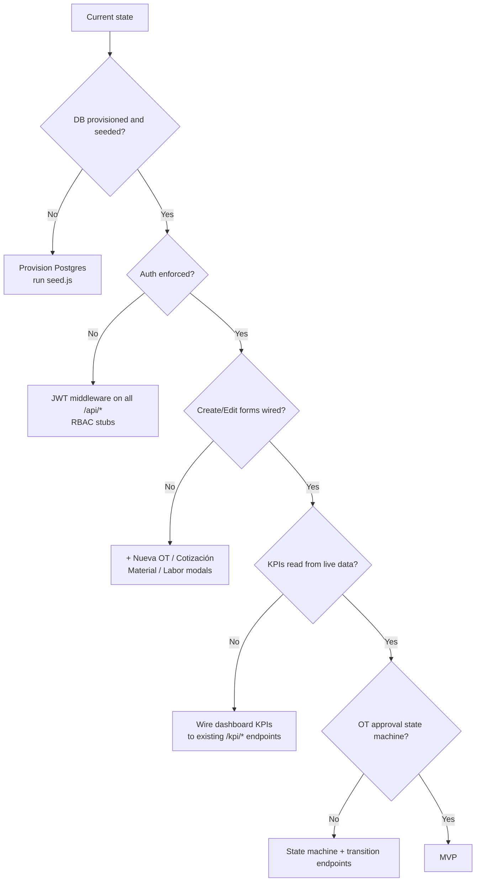

# Alenstec Cost Management — Design & Architecture Index

> **Status update (2026-04-20):** The project documentation was re-baselined to make [`alenstec_app.html`](../alenstec_app.html) the single source of truth. The feature-group structure below reflects the HTML's **10 modules**, not the earlier 8-feature-group summary. Individual design docs (`01-…` through `07-…`) are retained from the prior revision; several should be refactored to match the new module taxonomy — see "Design-doc coverage" below.

## How to read these docs

Each per-module design doc follows a common structure:

1. **Requirement recap** — derived from the HTML mockup. Linked to the matching `<module>-features.md` in the repo root.
2. **Intended design** — architecture, sequence diagrams, state machines.
3. **Current implementation** — what actually exists in code (`file:line` refs).
4. **Regression-test candidates** — promoted to the canonical list in [`../docs/regression-requirements.md`](../docs/regression-requirements.md).

Mermaid diagrams render in GitHub, GitLab, and VS Code (with *Markdown Preview Mermaid Support*).

## System architecture (as-built, April 2026)

```mermaid
flowchart LR
  subgraph Client
    HTML[alenstec_app.html<br/>vanilla JS SPA]
    PDFGEN[jspdf<br/>OT PDF export]
    XMLIN[DOMParser<br/>CFDI XML import]
  end

  subgraph Legacy[backend/server.js :3000]
    SRV1[Express legacy]
    R1[/api/work-orders]
    R2[/api/quotes]
    R3[/api/costs]
    R4[/api/suppliers]
    SRV1 --> R1 & R2 & R3 & R4
  end

  subgraph Conc[backend/src/server.js :3001]
    SRV2[Express + helmet + JWT]
    R5[/api/conciliacion/*]
    SRV2 --> R5
  end

  subgraph DB[PostgreSQL]
    M1[(WorkOrder)]
    M2[(Quote)]
    M3[(MaterialCost)]
    M4[(LaborCost)]
    M5[(Supplier)]
    M6[(empleados / semanas_nomina / …<br/>conciliación tables)]
  end

  subgraph Parallel[asistencia-modulo/ — scaffold only]
    ASIS[package.json + db/config.js]
  end

  subgraph Missing[Gaps: no backend]
    OCA[/api/purchase-orders-alenstec/]
    INV[/api/inventory/]
    SINV[/api/supplier-invoices/]
    DEL[/api/deliveries/]
    INC[/api/incidents/]
    EMP[/api/employees/]
    PAY[/api/payroll/*]
    FOR[/api/forecasting/]
    ACT[/api/activities/]
  end

  HTML -- fetch /api/* --> SRV1
  HTML -- fetch /api/conciliacion/* --> SRV2
  R1 --> M1
  R2 --> M2
  R3 --> M3 & M4
  R4 --> M5
  R5 --> M6
  SRV2 --> HTML
```

## Module → design-doc coverage

The HTML declares **10 modules**. Existing design docs cover 7 feature groups that roughly overlap. The right column shows whether the existing design doc is still accurate or needs a refactor.

| HTML module                        | data-mod        | Existing design doc                                       | Coverage     |
|------------------------------------|-----------------|------------------------------------------------------------|--------------|
| 1. Dashboard                       | `dashboard`     | [01-dashboard-analytics-design.md](./01-dashboard-analytics-design.md)   | Refactor — drop aspirational widgets |
| 2. Orden de Trabajo                | `ot`            | [02-work-orders-design.md](./02-work-orders-design.md)                   | Update with PDF flow + approval state machine |
| 3. Cotizaciones y Ventas           | `cotizaciones`  | [03-sales-quoting-design.md](./03-sales-quoting-design.md)               | Refactor — remove CRM/email sections |
| 4. Pronóstico del Costo            | `pronostico`    | [04-cost-forecasting-design.md](./04-cost-forecasting-design.md)         | Refactor — drop ML content |
| 5. Costo de Material               | `material`      | [05-material-management-design.md](./05-material-management-design.md)   | Refactor — limit scope to Requisición table |
| 6. Entregas de Material (5 subtabs)| `entregas`      | [05-material-management-design.md](./05-material-management-design.md) + [07-supplier-procurement-design.md](./07-supplier-procurement-design.md) | Split into 5 docs per subtab |
| 7. Horas de Mano de Obra           | `horas`         | [06-labor-management-design.md](./06-labor-management-design.md)         | Refactor — remove biometric/mobile sections |
| 8. Nómina / CFDI                   | `nomina`        | — **missing** —                                            | **Create** — schema for 86-col matrix |
| 9. Conciliación                    | `conciliacion`  | Referenced in [../docs/conciliacion-ops.md](../docs/conciliacion-ops.md) | **Promote to numbered design doc** |
|10. Costo de Mano de Obra           | `costomo`       | [06-labor-management-design.md](./06-labor-management-design.md)         | Split off — activity rollup is a distinct concern |

**Action items for the Phase-2 architecture kickoff:**

1. Rename / split existing design docs per the right-hand column above so each of the 10 modules has its own canonical architecture reference.
2. Add missing docs: Nómina/CFDI (`08-nomina-cfdi.md`) and Conciliación (`09-conciliacion.md`).
3. Add a cross-cutting doc `10-exports.md` covering jsPDF / exceljs / DOMParser flows.

## Feature status matrix (10-module baseline)

Cross-reference with the detailed feature docs in the repo root. Source data: [`../docs/implementation-audit.md`](../docs/implementation-audit.md).

| # | Module                   | Feature doc                                                                  | Status    | Backend                         | Frontend wiring                    |
|---|--------------------------|------------------------------------------------------------------------------|-----------|----------------------------------|------------------------------------|
| 1 | Dashboard                | [dashboard.md](../docs/modules/dashboard.md)         | Mockup    | KPI stubs, no wiring             | Static HTML                        |
| 2 | Orden de Trabajo         | [work-orders.md](../docs/modules/work-orders.md)     | Partial   | CRUD complete                    | Read-only + PDF export             |
| 3 | Cotizaciones             | [sales-quoting.md](../docs/modules/sales-quoting.md)                     | Mockup    | CRUD complete, KPI stub          | Static HTML                        |
| 4 | Pronóstico               | [cost-forecasting.md](../docs/modules/cost-forecasting.md)               | Mockup    | None                             | Static tables                      |
| 5 | Costo de Material        | [material.md](../docs/modules/material.md)         | Partial   | Partial CRUD                     | Read-only                          |
| 6 | Entregas (5 sub-tabs)    | [supplier-procurement.md](../docs/modules/supplier-procurement.md)       | Partial   | Suppliers only; 4 models missing | CFDI XML parse wired               |
| 7 | Horas                    | [labor.md](../docs/modules/labor.md)               | Mockup    | LaborCost model + 2 endpoints    | Static HTML                        |
| 8 | Nómina / CFDI            | [payroll-cfdi.md](../docs/modules/payroll-cfdi.md)                       | Mockup    | **Nothing**                      | Static + CFDI handler misrouted    |
| 9 | Conciliación             | [attendance-reconciliation.md](../docs/modules/attendance-reconciliation.md) | Partial | 13 endpoints + JWT + ExcelJS    | Checador + semanal + cierre wired; alertas + clasif form not wired |
|10 | Costo de Mano de Obra    | [labor.md](../docs/modules/labor.md)               | Mockup    | None (needs activity rollup)     | Static HTML                        |

**Legend:**
- *Mockup* — HTML only, no backend, no wiring.
- *Partial* — some flow end-to-end; gaps remain (see audit).
- *Mostly done* — golden paths work; edges missing.
- *Complete* — all acceptance criteria pass.

No module is currently *Complete*.

## MVP critical path (unchanged from prior revision, re-confirmed)

"MVP" = an operator can log in, create an OT, attach costs, see KPIs reflect reality, and export a PDF — without database surgery.



### Rough effort to MVP (unchanged)

| Blocker                                               | Effort | Why on critical path                               |
|-------------------------------------------------------|-------:|----------------------------------------------------|
| DB + seed documented and automated                    | 1–2 d  | Silent-fallback masks broken endpoints             |
| Auth + RBAC (resolve G-CONC-6, G-CONC-7)              | 4–6 d  | No demo without login; dev-fallback must go        |
| Form wiring (OT, Quote, MaterialCost, LaborCost)      | 5–7 d  | Users must be able to create data, not just view   |
| KPI endpoints + wiring                                | 2–3 d  | Dashboard credibility depends on this              |
| OT approval state machine                             | 4–6 d  | Core business process per spec                     |
| Error handling + user-visible validation              | 2–3 d  | Current silent-fail masks real bugs                |
| **Total**                                             | **~4 weeks** (one engineer) / ~2 weeks (two in parallel) |

### Not on MVP path

Forecasting algorithms, productivity analytics, CFDI real-time SAT validation, mobile app, biometric time tracking, multi-currency real-time FX, WebSocket streaming, scheduled reports, Gantt, email/SMS notifications. These are aspirational or mid/long-term.

## Regression-test priority map

See [`../docs/regression-requirements.md`](../docs/regression-requirements.md) for the full list. Summary:

**Stable enough to test now (~127 requirements):**
- Full UI shell: navigation, module switching, sidebar, topbar controls (AC-NAV-*).
- Every module's static DOM structure (AC-<MODULE>-NN UI).
- CFDI XML parser (AC-CFDI-01..10) against a fixture library.
- OT PDF export (AC-REP-01..06).
- Conciliación backend endpoints (AC-CONC-A01..17) + reconciliation rules (AC-CONC-R01..07).
- Cost-API CRUD (AC-OT-A*, AC-COT-A*, AC-MAT-A*, AC-HOR-A*, AC-PROV-A*).
- Conciliación XLSX export (AC-REP-11..14).

**Blocked on gap closures (~84 requirements):**
- Anything requiring auth enforcement (G-CONC-6/7).
- New models: PurchaseOrderAlenstec, InventoryItem, SupplierInvoice, Delivery, Incident, Employee, PayrollLine.
- Dashboard and Pronóstico live-data rendering.
- Nómina CFDI handler separation (G-NOM-3).

## Adjacent documents

- [`../docs/project-summary.md`](../docs/project-summary.md) — master index, terminology, tech stack.
- [`../docs/implementation-audit.md`](../docs/implementation-audit.md) — mockup-vs-implemented matrix, gap list, Phase-2 sequence.
- [`../docs/regression-requirements.md`](../docs/regression-requirements.md) — testable AC list, seeding strategy, test-suite layout.
- [`../docs/conciliacion-ops.md`](../docs/conciliacion-ops.md) — setup + operational guide for the conciliación module (retained for operator use; supersede the *requirements* sections with `attendance-reconciliation.md`).
- [`../docs/backend-setup.md`](../docs/backend-setup.md) — backend developer setup. Accurate as of 2026-04-20.
