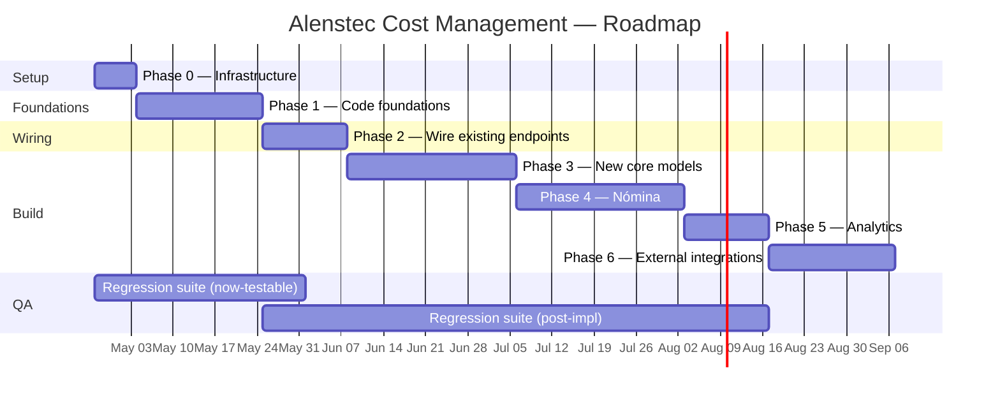

# Implementation Roadmap

> **Feeder documents:** [`implementation-audit.md`](./implementation-audit.md) (gap catalogue), [`regression-requirements.md`](./regression-requirements.md) (211+ ACs), [`../designs/00-architecture-decisions.md`](../designs/00-architecture-decisions.md) (ADR), [`project-summary.md`](./project-summary.md) (module map).
>
> **Purpose:** Sequence the closure of the ~28 gaps identified in the audit into phases with clear entry/exit gates, explicit dependencies, and a parallel regression-test track.

## Progress snapshot — 2026-04-20

| Phase | Scope                             | Status                                                                                                                                                                                                                                                                         |
| ----- | --------------------------------- | ------------------------------------------------------------------------------------------------------------------------------------------------------------------------------------------------------------------------------------------------------------------------------ |
| 0     | Infrastructure setup              | Partial — local Postgres 15 reachable; Tailscale/B2 still not verified in this repo. **CI ✅ landed (P1.17).**                                                                                                                                                                  |
| 1     | Code foundations — **backend**    | ✅ **Done** — single Express app on `:3000`, umzug migrations, JWT auth with boot-time secret guard, 6 roles seeded, FKs enforced, `asistencia-modulo/` removed. Verified end-to-end against local Postgres.                                                                    |
| 1     | Code foundations — **QA harness** | ✅ **Done (P1.17 + P1.18)** — jest + supertest smoke suite (health, auth, migrate/seed idempotence); ESLint `:recommended`; GitHub Actions workflow runs lint → migrate ×2 → seed → test against a Postgres 15 service container; `docker-compose.test.yml` for local dev.      |
| 1     | Code foundations — **frontend**   | ✅ **Done (P1.15 + P1.16)** — login overlay, `apiFetch` wrapper, `Authorization: Bearer` injection, single-flight refresh on 401, logout link; user chip renders current session. Existing wired fetches (work-orders, quotes, suppliers, conciliación) migrated to `apiFetch`. |
| 2+    | —                                 | Not started                                                                                                                                                                                                                                                                    |

**Backend exit criteria for Phase 1 — met:**

- [x] Single server binary serving both cost API and conciliación on `:3000`.
- [x] `asistencia-modulo/` deleted from repo.
- [x] No `/api/*` route reachable without valid JWT (except `/auth/*` and `/health`).
- [x] Seed script produces 6 test users with the 6 roles.
- [x] Schema migrations are idempotent (`npm run migrate && npm run seed` twice in a row succeeds).
- [x] FK enforcement verified — `material_costs.work_order_id`, `labor_costs.work_order_id`, `supplier_work_orders` join table.

**Still open in Phase 1:** — none. All backend + QA + FE foundation items are ✅.

**Deferred from Phase 1:** P1.7 — the cost/WO/quote models have no `supervisor_id` column to filter on, and the ownership semantic ("supervisor owns OT" vs "supervisor owns employee → labor-cost") is cleanest to pick after `Employee` lands. Moved to Phase 3, blocked on P3.16–P3.18 (G-HOR-3). Phase-1 hard exit criteria are unaffected — `verificarRol` already restricts supervisor writes to `POST /api/costs/labor`.

---

## Frozen architecture decisions

All six pre-Phase-1 decisions are made. Full rationale in [`../designs/00-architecture-decisions.md`](../designs/00-architecture-decisions.md).

| ADR | Decision                                    | Locked choice                                                   |
|-----|---------------------------------------------|-----------------------------------------------------------------|
| 001 | Server topology                             | **Single Express app** on `:3000`                               |
| 002 | Conciliación canonical                      | **Keep `backend/src/`**, delete `asistencia-modulo/`            |
| 003 | ORM                                         | **Sequelize default**, raw `pg` escape hatch for imports/aggs   |
| 004 | XLSX export                                 | **Server-side**, one endpoint per table, shared helper          |
| 005 | Auth                                        | **JWT**, 6 roles, fail-fast on default secret, no dev fallback  |
| 006 | FK on `otNumber` references                 | **Enforced**, `otNumber` kept as redundant human column         |
| 007 | Deployment target                           | **On-prem mini-PC**, Ubuntu 22.04, LAN-only                     |

---

## Deployment target

```
┌──────────────────────────────────────────────┐
│    Mini-PC (Ubuntu Server 22.04, LAN)        │
│                                              │
│   ┌──────────────┐                           │
│   │ PostgreSQL 15│ (alenstec DB)             │
│   └──────────────┘                           │
│   ┌──────────────┐                           │
│   │ Node/Express │ (single app, :3000)       │
│   └──────────────┘                           │
│   ┌──────────────┐                           │
│   │ systemd      │ (watchdog, auto-restart)  │
│   └──────────────┘                           │
│                                              │
│   Cron: pg_dump | gzip → /backups/           │
│   rclone → Backblaze B2 (off-site)           │
│   Tailscale: remote SSH for dev              │
└──────────────────────────────────────────────┘
         │  http://alenstec-costos.local:3000
         ▼
    Office LAN users
```

**Monthly cost:** ~$0.10 USD (Backblaze B2). PAC provider activates at Phase 6, pay-per-use.

**One-time cost:** $0–150 USD (used Dell OptiPlex from Mercado Libre if Alenstec doesn't have a spare box). 32 GB USB stick for local backups: ~$10 USD.

---

## Assumptions

| Assumption              | Value                                                          |
|-------------------------|----------------------------------------------------------------|
| Team (build)            | 1 backend engineer + 1 frontend engineer, full-time            |
| Team (QA)               | 1 QA engineer, full-time (regression suite in parallel)        |
| Calendar unit           | 1 week = 4.5 productive engineer-days per person               |
| Definition of done      | ACs green in CI + feature flag off by default                  |
| Language / framework    | Node/Express/Sequelize/vanilla JS (no changes)                  |
| Out of scope            | Mobile, biometric clock, ML forecasting, WebSockets, Gantt     |

If Team = 1, collapse parallel tracks; target v0.1-mvp at week 6–7, defer Phases 4–6.

---

## High-level sequence



**Total calendar:** ~19 weeks end-to-end. **MVP at end of Phase 2 (week ~6).** Each later phase ships as a point release — acceptable stopping points throughout.

---

## Pre-flight — things to gather before Phase 0

Three dependencies on Alenstec's side. Ask for them now.

1. **Mini-PC or spare box.** Any 2+ core machine with 4 GB RAM and 40 GB storage. If none available: used Dell OptiPlex ~$100–150 on Mercado Libre.
2. **CFDI samples.** 10–20 anonymized CFDI XMLs from Alenstec's history. Used in Phase 3 (persistence) and Phase 6 (PAC integration).
3. **User + role mapping.** List of Alenstec employees mapped to the six roles (`supervisor`, `jefe_area`, `rh`, `admin`, `ventas`, `compras`). Confirm role names match Alenstec's internal vocabulary (e.g. "comercial" vs "ventas").

Non-blocking but parallel:

4. **PAC provider preference.** Alenstec likely already uses one (Facturama, Finkok, Solución Factible, EdiconSA) for their own CFDI issuance. Reuse that account in Phase 6.

---

## Phase 0 — Infrastructure setup (1 week)

Stand up the target environment end-to-end, even if the app is still the mockup HTML.

### Work items

| ID    | Item                                                                       | Owner | Days |
|-------|----------------------------------------------------------------------------|-------|-----:|
| P0.1  | Install Ubuntu Server 22.04 on the mini-PC; disable password SSH           | BE    | 0.5  |
| P0.2  | `apt install postgresql-15 nodejs npm git`; create `alenstec_app` DB user  | BE    | 0.5  |
| P0.3  | systemd unit file for the Node app; boot test                              | BE    | 0.5  |
| P0.4  | Tailscale install; add engineers; verify remote SSH works                  | BE    | 0.5  |
| P0.5  | Backblaze B2 bucket + rclone config + nightly `pg_dump → B2` cron          | BE    | 1    |
| P0.6  | Deploy current `alenstec_app.html` + Express backend from `main`            | BE    | 0.5  |
| P0.7  | Configure local-hostname / mDNS so users reach `http://alenstec-costos.local:3000` | BE | 0.5  |
| P0.8  | `designs/00-architecture-decisions.md` committed (rationale captured)      | BE    | 0.5  |
| P0.9  | `designs/11-schema-target.md` drafted (final ER diagram post-Phase-3)      | BE    | 1    |
| P0.10 | QA: install Playwright + Jest + supertest; CI workflow on GitHub Actions   | QA    | 2    |

### Exit criteria (gate to Phase 1)

- [ ] Mini-PC reachable via Tailscale from a developer laptop.
- [ ] `http://alenstec-costos.local:3000` serves the current app from office LAN.
- [ ] Nightly backup has run at least once; restoring it to a scratch DB succeeds.
- [ ] GitHub Actions runs the empty test suite on every push.
- [ ] ADR doc + target-schema doc committed.

### Deliverables

- Running mini-PC (LAN address recorded).
- Backblaze B2 bucket credentials in a password manager.
- CI pipeline skeleton.
- [`../designs/00-architecture-decisions.md`](../designs/00-architecture-decisions.md) ✅ (already authored).
- `designs/11-schema-target.md` (new).

---

## Phase 1 — Code foundations (3 weeks)

Make the codebase safe to build on. This is where the ADRs turn into code.

### Work items

| ID    | Item                                                             | Owner | Days | ADR | Gap closed  | Status |
|-------|------------------------------------------------------------------|-------|-----:|-----|-------------|:------:|
| P1.1  | Merge `backend/server.js` into `backend/src/server.js`           | BE    | 2    | 001 | D-arch      | ✅     |
| P1.2  | Delete `asistencia-modulo/` (after `package.json` diff-migration) | BE    | 1    | 002 | G-CONC-8    | ✅     |
| P1.3  | Boot-time check: fail if `JWT_SECRET` unset or `'tu_secret_key'` | BE    | 0.5  | 005 | G-CONC-7    | ✅     |
| P1.4  | Remove dev JWT fallback `{id:1, rol:'admin'}`                    | BE    | 0.5  | 005 | G-CONC-6    | ✅     |
| P1.5  | `POST /api/auth/login` + `POST /api/auth/refresh` + seed 6 roles | BE    | 2    | 005 | (new)       | ✅     |
| P1.6  | Apply auth middleware to every `/api/*` route (except login/health) | BE | 1    | 005 | (new)       | ✅     |
| P1.7  | Per-record access filter extended from `filtrarPorSupervisor`    | BE    | 1    | 005 | (new)       | ⛔ **deferred to Phase 3** — blocked on G-HOR-3 (`Employee` master); no `supervisor_id` column on cost/WO/quote to filter on |
| P1.8  | Migration: extend `WorkOrder` w/ liberation-form fields          | BE    | 2    | —   | G-OT-2      | ✅ model-side; FE still renders mock values |
| P1.9  | Migration: extend `Quote` (cotRef, ocCliente, T/C, otNumber, tipo) | BE  | 1    | —   | G-COT-5     | ✅     |
| P1.10 | Migration: extend `MaterialCost` (IVA/ret/subtotal split)        | BE    | 1    | —   | G-MAT-4     | ✅     |
| P1.11 | Migration: `Supplier.saldoPendiente` field                        | BE    | 0.5  | —   | G-PROV-4    | ✅     |
| P1.12 | **FK migration:** add `work_order_id` to child tables, backfill, lock | BE | 2    | 006 | D-fk         | ✅ enforced on `material_costs` and `labor_costs` (`ON DELETE RESTRICT`) |
| P1.13 | Replace `Supplier.workOrders[]` w/ `supplier_work_orders` join    | BE    | 1    | 006 | D-fk         | ✅     |
| P1.14 | Migration tooling: replace `sequelize.sync({alter:true})` w/ umzug | BE  | 1    | 003 | (new)       | ✅ `src/db/migrator.js`; JS + SQL support; idempotent |
| P1.15 | Frontend login page + token/refresh handling (localStorage + cookie) | FE | 2   | 005 | —           | ✅ — localStorage session (access + refresh + user), overlay login card in `alenstec_app.html`, user chip + logout link in sidebar footer |
| P1.16 | Auth-error fetch interceptor (redirect to login on 401)          | FE    | 1    | 005 | —           | ✅ — `apiFetch()` wrapper auto-attaches Bearer; on 401, single-flight refresh then retry once; on refresh failure, clears session and shows login overlay |
| P1.17 | CI: lint + unit tests + migration dry-run + seed check           | QA    | 2    | —   | (new)       | ✅     |
| P1.18 | Ephemeral-Postgres test harness (Docker + seed)                  | QA    | 2    | —   | —           | ✅     |

### Regression track (QA in parallel, 3 weeks)

Author the **127 now-testable ACs** from `REGRESSION_REQUIREMENTS.md`:

- AC-NAV-* (10) — sidebar, topbar, module switching
- AC-<MODULE>-NN UI across all 10 modules (~60)
- AC-CFDI-01..10 with fixture library
- AC-OT-09..12 + AC-REP-01..06 (PDF)
- AC-OT-A*, AC-COT-A*, AC-MAT-A*, AC-HOR-A*, AC-PROV-A* (~26 API contract)
- AC-CONC-A01..17 + AC-CONC-R01..07 (~24 conciliación)

### Exit criteria (gate to Phase 2)

- [ ] Single server binary serving both cost API and conciliación on `:3000`.
- [ ] `asistencia-modulo/` deleted from repo.
- [ ] No `/api/*` route reachable without valid JWT (except `/auth/*` and `/health`).
- [ ] Seed script produces 4+ test users with the 6 roles.
- [ ] Schema migrations are idempotent (`npm run migrate && npm run seed` on empty DB works twice in a row).
- [ ] FK enforcement verified — attempting to delete a `WorkOrder` with child costs returns a DB error.
- [ ] Regression suite: ≥ 90 % of 127 now-testable ACs passing on main.

---

## Phase 2 — Wire existing endpoints → MVP (2 weeks)

All Priority-3 gaps from the audit. Each is a small `fetch+render` per module.

### Work items

| ID    | Item                                                                | Owner  | Days | Gap closed |
|-------|---------------------------------------------------------------------|--------|-----:|------------|
| P2.1  | Dashboard — wire 4 KPIs to `/api/*/kpi/*`                           | FE     | 1    | G-DASH-1   | ✅ |
| P2.2  | Dashboard — wire Recent-OT table to `/api/work-orders`              | FE     | 0.5  | G-DASH-2   | ✅ |
| P2.3  | Dashboard — derive cost-per-OT bars                                 | FE     | 0.5  | G-DASH-3   | ✅ |
| P2.4  | Dashboard — wire Proveedores timeline to `/api/suppliers`           | FE     | 0.5  | G-DASH-4   | ✅ |
| P2.5  | Cotizaciones — wire table to `/api/quotes`                          | FE     | 1    | G-COT-2    | ✅ |
| P2.6  | Cotizaciones — wire KPI strip                                       | FE     | 0.5  | G-COT-4    | ✅ |
| P2.7  | OT — OT selector repopulates form via `GET /api/work-orders/:id`    | FE     | 1    | G-OT-1     | ✅ |
| P2.8  | OT — `+ Nueva OT` creation modal → `POST`                           | FE     | 2    | G-OT-3     | ✅ |
| P2.9  | Material — wire Requisición table to `/api/costs/material`          | FE     | 1    | G-MAT-2    | ✅ |
| P2.10 | Material — `+ Registrar material` modal → `POST`                    | FE     | 1    | G-MAT-1    | ✅ |
| P2.11 | Entregas/Proveedores — wire table + `+ Agregar proveedor` modal      | FE     | 1.5  | G-PROV-1,2 | ✅ |
| P2.12 | Horas — wire Resumen table to `/api/costs/labor`                    | FE     | 1    | G-HOR-2    | ✅ |
| P2.13 | Horas — `+ Capturar horas` modal → `POST`                           | FE     | 1    | G-HOR-1    | ✅ |
| P2.14 | Conciliación/Alertas — wire to `GET /api/conciliacion/:id/alertas`  | FE     | 0.5  | G-CONC-1   | ✅ |
| P2.15 | Conciliación/Clasificación — wire form to `POST /horas-clasificadas` | FE    | 1    | G-CONC-2   | ✅ |
| P2.16 | Conciliación — populate week selector from DB                       | FE     | 0.5  | G-CONC-5   | ✅ |
| P2.17 | **XLSX export: shared helper + 5 endpoints + UI wiring** (ADR-004)   | BE+FE | 4    | G-EXP-1    | ✅ (partial — 5 of ~11 tables; 6 buttons for mockup modules stay disabled) |

### Regression track

Promote ~35 "Future-testable" ACs from `REGRESSION_REQUIREMENTS.md` to active:
- AC-DASH-F1, F2
- AC-COT-F1
- AC-MAT-F1
- AC-CONC-31 post-fix, AC-CONC-F1 (form persistence)
- AC-REP-11..14 generalized across all 12 export endpoints

### Exit criteria — **MVP Gate**

- [ ] Operator can log in → create an OT → attach material cost line → attach labor cost line → see dashboard KPIs reflect those costs → export OT PDF → export each table to XLSX.
- [ ] Every `⬇ Descargar XLSX` button produces a valid `.xlsx` download.
- [ ] Conciliación fully wired (alertas + clasificación now persist to backend).
- [ ] Regression suite: ~162 ACs active, 100 % passing.

**Release tag: `v0.1-mvp`** — week ~6. First acceptable stopping point.

---

## Phase 3 — New core models (4 weeks)

Build what the mockup shows but the backend has never had.

### Work items

| ID    | Item                                                             | Owner | Days | Gap closed  |
|-------|------------------------------------------------------------------|-------|-----:|-------------|
| P3.1  | Model + migration: `PurchaseOrderAlenstec`                        | BE    | 1    | G-OCA-1     |
| P3.2  | Routes: `/api/purchase-orders-alenstec` CRUD + filters           | BE    | 2    | G-OCA-2     |
| P3.3  | FE: sub-tab 6.2 wired + `+ Capturar OCP` modal                   | FE    | 2    | G-OCA-3     |
| P3.4  | Model + migration: `InventoryItem` + `StockMovement`              | BE    | 2    | G-INV-1     |
| P3.5  | Routes: `/api/inventory` CRUD                                     | BE    | 2    | G-INV-2     |
| P3.6  | FE: sub-tab 6.3 wired + `+ Agregar existencia` modal              | FE    | 2    | G-INV-3     |
| P3.7  | Rule: `Delivery` create increments `InventoryItem.existencia`     | BE    | 1    | G-INV-4     |
| P3.8  | Model + migration: `SupplierInvoice` (indexed UUID)               | BE    | 1    | G-FACT-2    |
| P3.9  | Route: `POST /api/invoices/cfdi` (server-side XML persistence)    | BE    | 2    | G-FACT-2    |
| P3.10 | FE: CFDI upload POSTs to backend, renders from response           | FE    | 1    | G-FACT-2    |
| P3.11 | FE: `+ Agregar factura` manual form                               | FE    | 1    | G-FACT-3    |
| P3.12 | Models + migrations: `Delivery`, `Incident`                       | BE    | 1    | G-ENTR-1    |
| P3.13 | Routes: `/api/deliveries`, `/api/incidents`                       | BE    | 2    | G-ENTR-2    |
| P3.14 | FE: sub-tab 6.5 + `+ Registrar entrega` / `+ Ingresar incidencia` | FE    | 2    | G-ENTR-2    |
| P3.15 | KPI: `GET /api/deliveries/kpi`                                    | BE    | 1    | G-ENTR-3    |
| P3.16 | Model + migration: `Employee` (Control-de-Empleados columns)      | BE    | 1    | G-HOR-3     |
| P3.17 | Route: `/api/employees` CRUD + import-from-seed                   | BE    | 1    | G-HOR-3     |
| P3.18 | FE: sub-tab 7.2 Control de Empleados                              | FE    | 1    | G-HOR-3     |
| P3.18b| **Per-record ACL (deferred from P1.7):** pick ownership semantic (OT-level via `work_orders.supervisor_id` vs labor-cost via `empleado.supervisor_id`); migration + wire `filtrarPorSupervisor` into list endpoints | BE | 1.5 | G-HOR-3 |
| P3.19 | Model + migration: `WorkOrderApproval`                            | BE    | 1    | G-OT-4      |
| P3.20 | Routes: approval-transition endpoints + role checks               | BE    | 2    | G-OT-4      |
| P3.21 | FE: Flujo de Liberación with per-row transition buttons           | FE    | 2    | G-OT-4      |

### Regression track

- Promote AC-ENT-F21, F31, F51, F52 (new model CRUD).
- Promote AC-HOR-F3 (Employee master).
- Promote AC-OT-F3 (approval workflow).
- Author ~40 new ACs for new-model CRUD contract tests.

### Exit criteria

- [ ] All 5 Entregas sub-tabs fully wired end-to-end.
- [ ] Employees can be CRUD'd; Control de Empleados reflects live data.
- [ ] OT approval flow transitions through its 5 steps with role enforcement + audit trail.
- [ ] Regression suite: ~202 ACs active, 100 % passing.

**Release tag: `v0.2-entregas`** — week ~10.

---

## Phase 4 — Nómina (4 weeks)

The hardest phase — 86-column matrix + Mexican payroll rules.

### Work items

| ID    | Item                                                                          | Owner | Days | Gap closed |
|-------|-------------------------------------------------------------------------------|-------|-----:|------------|
| P4.1  | **Paper-schema review** with client: `PayrollWeek` + `PayrollLine` layout     | BE+client | 1 | G-NOM-4   |
| P4.2  | Migration: payroll tables per agreed schema                                   | BE    | 1    | G-NOM-4    |
| P4.3  | IMSS calculator (cuotas obrero-patronal)                                       | BE    | 2    | G-NOM-5    |
| P4.4  | ISR calculator (tarifa 2026 + subsidio al empleo)                              | BE    | 2    | G-NOM-5    |
| P4.5  | INFONAVIT + FONACOT deduction applicators                                     | BE    | 1    | G-NOM-5    |
| P4.6  | Reference data: 2026 ISR-tarifa + subsidio-empleo tables                      | BE    | 1    | G-NOM-5    |
| P4.7  | Routes: `/api/payroll/weeks` + `/api/payroll/lines` CRUD                      | BE    | 2    | G-NOM-2    |
| P4.8  | Route: `GET /api/payroll/lines?semana=&año=` (Captura feed)                  | BE    | 1    | G-NOM-2    |
| P4.9  | FE: Captura table wired to API (all 86 columns, with validation)              | FE    | 3    | G-NOM-2    |
| P4.10 | FE: `+ Nueva línea` modal w/ employee picker + auto-compute deductions        | FE    | 2    | G-NOM-1    |
| P4.11 | Separate CFDI-nómina handler (complemento 1.2 parser)                         | BE    | 3    | G-NOM-6    |
| P4.12 | Route: `POST /api/payroll/cfdi` + `GET /api/payroll/cfdi/:uuid`               | BE    | 1    | G-NOM-6    |
| P4.13 | FE: CFDI sub-tab — route `+ Cargar CFDI` to own handler (not Facturas)        | FE    | 1    | G-NOM-3    |
| P4.14 | FE: Resumen sub-tab — 4 KPIs + Detalle table from backend                     | FE    | 1    | —          |

### Regression track

- AC-NOM-F1 (86-leaf header snapshot) — active day 1 of phase.
- AC-NOM-F2..F4 — promoted as endpoints land.
- **Calculator unit tests (AC-NOM-C01..20)** — pure-function, extremely stable. Hand-compute 20 reference scenarios with client; lock them in.

### Exit criteria

- [ ] A weekly payroll line can be captured for one employee; total percepciones, deducciones, and pago all match a hand-computed reference to the peso.
- [ ] CFDI-nómina upload persists without touching Facturas.
- [ ] Resumen sub-tab KPIs aggregate captured lines correctly.
- [ ] Regression suite: ~227 ACs active, 100 % passing.

**Release tag: `v0.3-nomina`** — week ~14.

---

## Phase 5 — Analytics (2 weeks)

### Work items

| ID    | Item                                                                 | Owner | Days | Gap closed      |
|-------|----------------------------------------------------------------------|-------|-----:|-----------------|
| P5.1  | Endpoint: `GET /api/forecasting?year=`                               | BE    | 2    | G-PRON-1        |
| P5.2  | Variance + semáforo rules codified + unit tests                       | BE    | 1    | G-PRON-3        |
| P5.3  | FE: wire Pronóstico table + KPI strip                                | FE    | 1    | G-PRON-2        |
| P5.4  | Model: `ActivityCategory` (A–M + numeric indirect codes)             | BE    | 1    | G-HOR-4         |
| P5.5  | Migration: add `LaborCost.activityCode` FK; backfill from free-text   | BE    | 1    | G-HOR-4         |
| P5.6  | Endpoint: `GET /api/costs/labor/rollup?otNumber=`                    | BE    | 2    | G-MO-1          |
| P5.7  | Define & implement Costo/Real rule (client signoff before coding)     | BE    | 1    | G-MO-2          |
| P5.8  | FE: wire Costo-MO table to rollup                                    | FE    | 1    | G-MO-1,2        |
| P5.9  | Endpoint: `GET /api/dashboard/ocs-abiertas`                          | BE    | 1    | G-DASH-5        |
| P5.10 | Endpoint: `GET /api/dashboard/empleados-en-campo`                     | BE    | 1    | G-DASH-6        |
| P5.11 | FE: wire OCs Abiertas + Empleados en Campo widgets                    | FE    | 1    | G-DASH-5,6      |

### Exit criteria

- [ ] Dashboard has no mockup widgets remaining.
- [ ] Pronóstico shows live variance + semáforo for every active OT.
- [ ] Costo-MO shows real hours from LaborCost with Real-cost computed per agreed rule.
- [ ] Regression suite: ~242 ACs active, 100 % passing.

**Release tag: `v0.4-analytics`** — week ~16.

---

## Phase 6 — External integrations (3 weeks)

### Work items

| ID    | Item                                                                    | Owner | Days | Gap closed |
|-------|-------------------------------------------------------------------------|-------|-----:|------------|
| P6.1  | PAC provider research + contract (reuse Alenstec's existing account)     | BE    | 2    | G-FACT-1   |
| P6.2  | Integration: `POST /api/invoices/cfdi` calls PAC; stores result          | BE    | 4    | G-FACT-1   |
| P6.3  | UI: Validación SAT badge reflects real state (`válida`/`no válida`/`pendiente`) | FE | 1 | G-FACT-1 |
| P6.4  | Decide fate of `html2canvas` (remove, or wire a feature)                 | FE    | 0.5  | —          |
| P6.5  | Legacy doc cleanup: `CONCILIACION_README.md` → ops-only scope            | —     | 0.5  | —          |
| P6.6  | Observability: Sentry free tier + `morgan` access logs to file           | BE    | 1.5  | (new)      |
| P6.7  | UptimeRobot free tier pinging `/api/health`                              | BE    | 0.5  | (new)      |
| P6.8  | Pre-release hardening: env-check on boot, graceful shutdown, 404 JSON    | BE    | 1    | (new)      |
| P6.9  | Backup restoration drill (quarterly process documented in runbook)       | BE    | 0.5  | (new)      |

### Exit criteria

- [ ] CFDI validation reflects real SAT state; mock `✓ Importada` badge gone.
- [ ] All mockup-legacy surface is wired or explicitly removed.
- [ ] Sentry reports errors from prod; UptimeRobot has pinged `/api/health` 100+ times without incident.
- [ ] Backup → restore → app-functional cycle rehearsed once.
- [ ] Regression suite: ~252 ACs active, 100 % passing.

**Release tag: `v1.0`** — week ~19.

---

## Parallel track — Regression suite

QA engineer authors alongside each phase, never behind by more than half a phase.

| Phase | ACs added     | Cumulative |
|-------|---------------|-----------:|
| 0     | 0 (framework only) | 0      |
| 1     | ~127          | 127         |
| 2     | ~35           | 162         |
| 3     | ~40           | 202         |
| 4     | ~25           | 227         |
| 5     | ~15           | 242         |
| 6     | ~10           | 252         |

CI gate: main branch requires **100 % of active ACs passing**. Flaky tests tagged and triaged weekly.

---

## Risks & unknowns

| Risk                                                       | Mitigation                                                     |
|------------------------------------------------------------|----------------------------------------------------------------|
| Client changes the mockup mid-roadmap                       | Freeze `alenstec_app.html` at start of each phase; changes → Phase 7+ backlog. |
| Mexican payroll law changes (ISR, UMA, cuotas)              | Data-driven calculators; annual review task.                   |
| SAT/PAC API instability                                     | Async w/ retry + `pendiente` state.                            |
| DB migrations on production data                             | Every migration reversible; staging rehearsal before prod.      |
| `asistencia-modulo/` deletion loses unique code              | Diff both `package.json`s before delete (P1.2); scan `db/config.js`. |
| 86-column nómina schema is wrong                            | P4.1 is an explicit paper review with client before code.       |
| Costo-Real rule is undefined at Phase 5                     | P5.7 blocks on client sign-off — escalate early.               |
| Mini-PC hardware failure                                     | Off-site B2 backup + Tailscale-over-4G hotspot fallback for emergency SSH. |
| Power outage                                                 | Accept downtime; plant is also down. Optional UPS for ~$40.    |
| Solo engineer instead of 2+QA                               | Collapse parallel tracks; extend calendar ~1.6× to ~30 weeks.  |

---

## Out of scope (v2+ backlog)

- Mobile app / React Native
- Biometric / facial-recognition clock
- GPS field tracking
- Real-time WebSocket updates
- ML predictive forecasting
- Gantt chart visualization
- Email / SMS notifications
- Drag-and-drop report builder
- Supplier self-service portal
- Electronic-signature capture
- Three-way match automation
- SOX / GDPR compliance tooling
- Multi-plant / multi-tenant

Add to separate v2 backlog if desired. Do not infiltrate this roadmap.

---

## Release plan at a glance

| Tag               | Phase exit | Calendar | Demoable state                                                                 |
|-------------------|------------|---------:|---------------------------------------------------------------------------------|
| `v0.1-mvp`        | Phase 2    | ~week 6  | Login → OT CRUD → costs → dashboard reflects reality → PDF/XLSX exports         |
| `v0.2-entregas`   | Phase 3    | ~week 10 | All 5 Entregas sub-tabs wired; OT approval workflow live; employee master        |
| `v0.3-nomina`     | Phase 4    | ~week 14 | Weekly payroll + CFDI-nómina import, peso-accurate calculators                   |
| `v0.4-analytics`  | Phase 5    | ~week 16 | Pronóstico, Costo-MO rollup, final dashboard widgets                             |
| `v1.0`            | Phase 6    | ~week 19 | Real SAT validation, Sentry + UptimeRobot, backup drill rehearsed                |

**Each tag is an acceptable stopping point.** If priorities shift, the business can operate on any of them.
